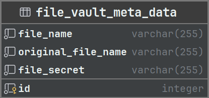

# Python Secure File Vault

Projekt zaliczeniowy na przedmiot *Wstęp do algorytmów* na [Akademii Górnośląskiej](https://www.gwsh.pl) w Katowicach.

Projekt jest prostym API umożliwiającym zdalne przechowywanie plików w bezpieczny sposób.

## Stos technologiczny

- [Flask](https://flask.palletsprojects.com/en/3.0.x)
- [SQLAlchemy](https://www.sqlalchemy.org)

### Diagram bazy danych



## Uruchomienie

### Wersja rozwojowa

```bash
pip install --requirement requirements.txt
python app.py
```

### Wersja produkcyjna

[Oficjalna dokumentacja](https://flask.palletsprojects.com/en/3.0.x/deploying)

## Funkcjonalności

- podstawowa walidacja żądań
- szyfrowanie plików algorytmem [Fernet](https://cryptography.io/en/latest/fernet) z biblioteki [cryptography](https://cryptography.io/en/latest)
- zabezpieczenie dostępu do plików hasłem z użyciem algorytmu [Argon2](https://en.wikipedia.org/wiki/Argon2)

## Przykładowe użycie

### Wysłanie pliku do przechowania

```bash
curl --location --request POST 127.0.0.1:5000/encrypt \
--form "file=@file-path" \
--form "file_secret=*"
```

### Pobranie pliku

```bash
curl --location --request POST 127.0.0.1:5000/decrypt \
--form "file_name=*" \
--form "file_secret=*"
```

## Autor

- [Jakub Bukała](https://github.com/Jaku-BB)